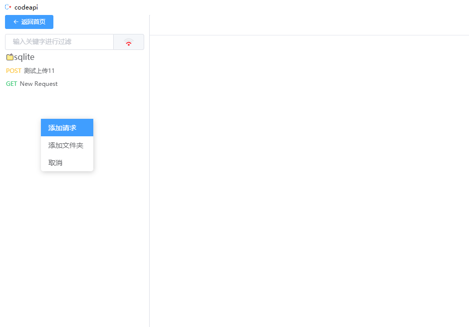

<!--
 * @Author: Chen
 * @Email: cnblogco@qq.com
 * @Date: 2021-07-01 11:14:06
 * @LastEditTime: 2021-07-02 16:47:24
 * @Description: ...每位新修改者自己的信息
-->
# codeApi

用于前端API模拟接口，实现前开发，不受后端接口约束。
内置mysql 、sqlite 、mock

##  创建数据库
`mysql 支持联机操作，可以团队协作`


## 点击标题进入数据库,使用前记得先【启动服务】

`左侧菜单可以右键添加菜单、和文件目录`


### mock 使用(图下有详细的使用)


### sql语法使用
`这里要注意，sqlite 和 mysql API一致, db.all 只能查询（SELECT）`


```js 
  // 查询
 try {
    let all = await db.all('SELECT * FROM h_test')
    return {
        code: 200,
        data: all
    }
} catch (error) {
    return error
}


// 新增
try {
    const { name, sex } = req.query;
    const arr = await db.run("insert into h_test(name,sex) VALUES(?,?)", [name, sex]);
    console.log()
    return {
        code: 200,
        data: arr
    }
} catch (error) {
    return error
}


// 修改

try {
    const { sex, name } = req.query;
    const all = await db.run("UPDATE h_test set sex = ? WHERE name=?", [sex, name])
    return {
        code: 200,
        msg: '修改成功'
    }
} catch (error) {
    return {
        code: 404,
        msg: error
    }
}


// 删除
try {
    const { name } = req.query;
    const all = await db.run("DELETE FROM h_test WHERE name = ? ", [name])
    return {
        code: 200,
        msg: '删除成功！'
    }
} catch (error) {
    return {
        code: 404,
        error: error
    }
}
```


### utils 是一个代码扩展对象（还在完善中）
```js

utils.dataBase(Object)  => 用来连接sqlite || mysql 

utils.__dirpath   =>  静态路径 ，返回 D:\Programs\codeapi\resources\

```


### mysql 连接其他数据库 API使用

`utils 是一个全局对象`

```js
// mysql 连接代码案例

try {
    const dbs = await utils.dataBase({
        host: 'localhost',
        user: 'root',
        password: 'root',
        database: 'cnblog_vip'
    })
    const all = await dbs.all("SELECT * FROM love");
    return {
        code: 200,
        data: all
    }
} catch (error) {
    console.log(error)
    return {
        code: 404,
        error: error
    }
}
```


### sqlite 连接其他数据库 API使用

`这里需要注意sqlite连接使用的是路径,所以需要注意软件地址问题 案例：database: 'D:\\Programs\\codeapi\\resources\\saves\\db\\code.db'  这种格式需要就是正确的`


```js
// mysql 使用方式


// 错误方式 
// database: '/Code/C/test.db' 
// database: 'D:\Programs\codeapi\resources\saves\db\code.db'   
// database: `./saves/system/system.db`

// 以下3种连接方式都是正确的
// database: 'D:/Code/C/test.db' 
// database: 'D:\\Programs\\codeapi\\resources\\saves\\db\\code.db'   
// database: `${utils.__dirpath}/saves/system/system.db`

try {
    const database = await utils.dataBase({
        type: 'sqlite',
        database: 'D:/Code/C/test.db'   
        // database: 'D:\\Programs\\codeapi\\resources\\saves\\db\\code.db'   
        // database: `${utils.__dirpath}/saves/system/system.db`
    })
    const s = await database.run("insert into test(name,sex) VALUES(?,?)", ['小艾', '女'])
    console.log(s)
    const all = await database.all("SELECT * FROM test")

    return {
        code: 200,
        path: utils.__dirpath,
        all: all
    }
} catch (error) {
    return {
        code: 404,
        error: error
    }
}
```


### 你以为这就结束了吗？ 不存在的。
`接下来展示大招，点击抓包界面`


`为了方便抓取以前的数据，内置了一个抓包工具，可以方便添加到菜单栏，接口数据只会生成mock,也就是所谓的json数据`


`可以添加到左侧菜单栏`